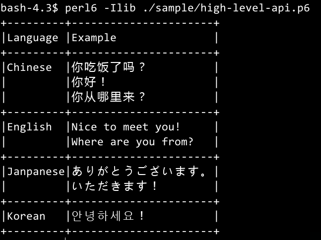
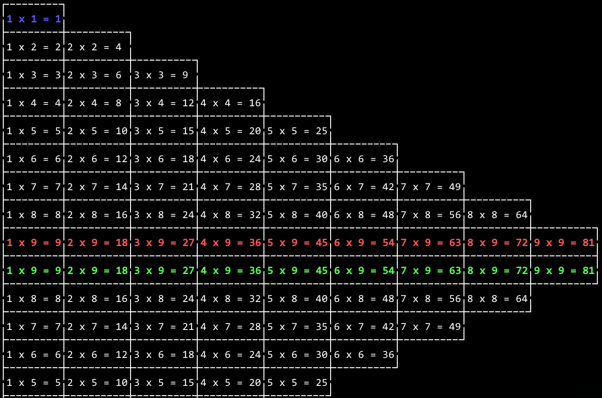
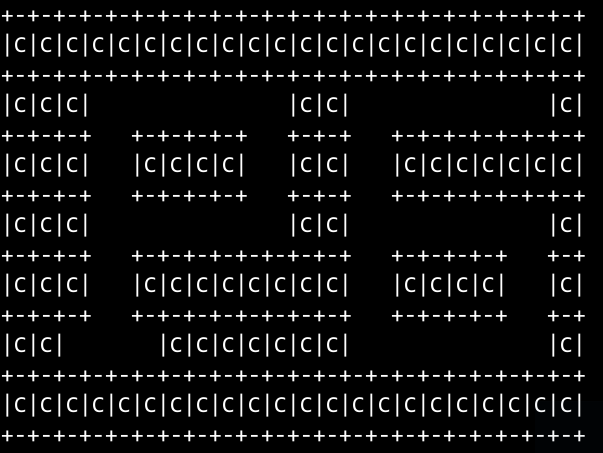

# Terminal-Table
:toc-title: contents

Advanced table generate module for perl6

image:https://travis-ci.org/araraloren/perl6-terminal-table.svg?branch=master["Build Status", link="https://travis-ci.org/araraloren/perl6-terminal-table"]

# 描述

`Terminal::Table` 可以很方便的生成用于终端显示的各种表格，并且支持彩色以及多行单元格、
以及不规则形状表格，模块提供非常多的常用风格，另外你还可以通过模块提供的低级接口来生成
独特风格的表格。

# 用法

## 例子

### High Level Interface

[source, perl6]
--------------------------
use Terminal::Table;

my @data = [
    [ "Language", "Example" ],
    [ "Chinese",  "你吃饭了吗？\n你好！\n你从哪里来？" ],
    [ "English",  "Nice to meet you!\nWhere are you from?" ],
    [ "Janpanese","ありがとうございます。\nいただきます！"],
    [ "Korean",   "안녕하세요！"],
];

print-table(@data);
--------------------------

这个例子将会输出：

### Low Level Interface

[source, perl6]
--------------------------
#!/usr/bin/env perl6

use v6;
use Terminal::Table::Generator;
use Terminal::Table::Style;

my $g = Generator.new(
    style => Style.new(
        corner-style => Style::Corner.double(),
        line-style => Style::Line.double(),
        content-style => Style::Content.space(),
    )
);

$g.add-cell('Language');
$g.add-cell('Example');
$g.add-cell('Country');
$g.end-line;
$g.add-cell('Chinese');
$g.add-cell("你吃饭了吗？\n你好！\n你从哪里来？");
$g.add-cell('China');
$g.end-line;
$g.add-cell('Janpanese');
$g.add-cell('
ありがとうございます。
いただきます！');
$g.add-cell('Janpa');
$g.end-line;
$g.add-cell('English');
$g.add-cell('Nice to meet you!
Are you ok?
Where are you from ?');
$g.add-cell('American、England、Australian .etc');
$g.end-line;
$g.add-cell('Korean');
$g.add-cell('안녕하세요！');
$g.add-cell('Korea');
$g.end-line;
$g.generator().generate().print();
--------------------------

这个例子将会输出：

image:resources/output2.png[output for low-level-api]

### Generator join 以及 colour

Terminal::Table 使用模块 https://github.com/tadzik/Terminal-ANSIColor[Terminal::ANSIColor] 来处理颜色。

[source, perl6]
--------------------------
#!/usr/bin/env perl6

use Terminal::Table::Style;
use Terminal::Table::Generator;

my $gl = Generator.new(
    style => Style.new(
        corner-style => Style::Corner.double(),
        line-style   => Style::Line.double(),
        content-style=> Style::Content.space(),
    )
);

for 1 .. 9 -> \x {
    for 1 .. x -> \y {
        $gl.add-cell("{y} x {x} = {x * y}");
    }
    $gl.end-line();
}

my $gr = Generator.new(
    style => Style.new(
        corner-style => Style::Corner.single(),
        line-style   => Style::Line.dot(),
        content-style=> Style::Content.space(),
    )
);

my @data;

for reverse 1 .. 9 -> \x {
    @data.push([ "{.Int} x {x} = {x * .Int}" for 1 .. x ]);
}

$gr.from-array(@data);
$gl.join($gr, :replace-style);

my $g = $gl.generator().generate();

$g.colour(0, 0, Color::String.new(color => <blue bold> ));
$g.colour(8, $_, Color::String.new(color => <red bold> )) for ^9;
$g.colour(9, $_, Color::String.new(color => <green bold> )) for ^9;
$g.print(:coloured);
--------------------------

这个例子将会输出：

### 不规则形状

[source, perl6]
-------------------------
#!/usr/bin/env perl6

use v6;
use Terminal::Table;

constant SIZE = 22;

my $g = create-generator([
    'C' xx SIZE,
    'C' xx SIZE,
    'C' xx SIZE,
    'C' xx SIZE,
    'C' xx SIZE,
    'C' xx SIZE,
    'C' xx SIZE,
]);

$g.generate;

my &hide = -> $x, $y {
    my ($r, $c) = ($g.row-count() * 2, $g.col-count($x) * 2);
    my ($rx, $ry) = ($x * 2, $y * 2);

    my $top = $rx == 0 || $g.is-hidden($rx - 1, $ry + 1);
    my $top-left = ($rx == 0 || $ry == 0) || $g.is-hidden($rx - 1, $ry - 1);
    my $top-right = ($rx == 0 || $ry + 2 == $c) || $g.is-hidden($rx - 1, $ry + 3);
    my $bottom = ($rx + 2 == $r) || $g.is-hidden($rx + 3, $ry + 1);
    my $bottom-left = ($rx + 2 == $r || $ry == 0) || $g.is-hidden($rx + 3, $ry - 1);
    my $bottom-right = ($rx + 2 == $r || $ry + 2 == $c) || $g.is-hidden($rx + 3, $ry + 3);
    my $left = $ry == 0 || $g.is-hidden($rx + 1, $ry - 1);
    my $right = ($ry + 2 == $c) || $g.is-hidden($rx + 1, $ry + 3);

    if $top && $top-left && $left {
        $g.hide($rx, $ry, :replace-with-space);
    }
    if $top {
        $g.hide($rx, $ry + 1, :replace-with-space);
    }
    if $top && $top-right && $right {
        $g.hide($rx, $ry + 2, :replace-with-space);
    }
    if $left {
        $g.hide($rx + 1, $ry, :replace-with-space);
    }
    if $right {
        $g.hide($rx + 1, $ry + 2, :replace-with-space);
    }
    if $left && $bottom-left && $bottom {
        $g.hide($rx + 2, $ry, :replace-with-space);
    }
    if $bottom {
        $g.hide($rx + 2, $ry + 1, :replace-with-space);
    }
    if $right && $bottom-right && $bottom {
        $g.hide($rx + 2, $ry + 2, :replace-with-space);
    }
    $g.hide($rx + 1, $ry + 1, :replace-with-space);
};

&hide(1, 13 + $_) for ^8;
&hide($_, 13) for 2 .. 5;
&hide($_, 14) for 2 .. 5;
&hide(5, 13 + $_) for ^8;
&hide($_, 20) for 3 .. 4;
&hide($_, 19) for 3 .. 4;
&hide(3, 15 + $_) for ^5;

&hide(1, 3 + $_) for ^8;
&hide($_, 3) for 2 .. 5;
&hide($_, 4) for 2 .. 5;
&hide($_, 10) for 2 .. 3;
&hide($_, 9) for 2 .. 3;
&hide(3, 4 + $_) for ^6;
&hide(5, 2 + $_) for ^4;

$g.print;
-------------------------

这个例子将会输出（图形中画了一个P6）：

### 更多

对于更多用法，请参考 link:sample/[sample] 文件夹中例子或者 POD 文档。

# 安装

## 从源码安装
[source, shell]
--------------------------
git clone https://github.com/araraloren/perl6-terminal-table

cd perl6-terminal-table

git checkout v0.3.5(你想安装的版本tag)

zef install .
--------------------------

## 从 zef

[source, shell]
-------------------------
zef update

zef install Terminal::Table
-------------------------

# License

    The MIT License (MIT).

# 作者

    Araraloren. Email: blackcatoverwall@gmail.com

# TODO

    暂无
